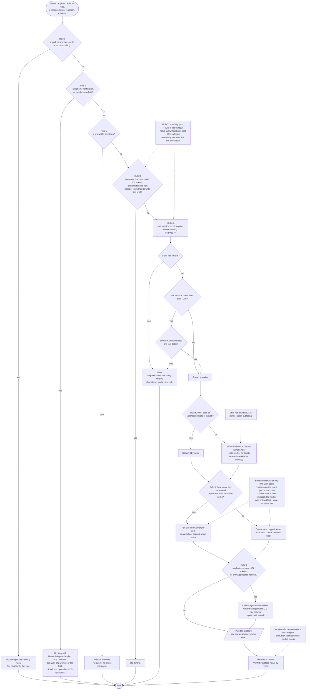

# Delegate or inline: the orchestrator's decision tree

Source of truth: `.kiro/skills/agent-orchestration-workflows/SKILL.md` (The delegate-or-inline
decision). This chart restates it; the source binds.

## How to read

- Rectangles are actions, diamonds are decisions, stadiums are the start and end, the
  parallelogram hands off to the spawn-strategy-router chart, and nodes joined by dotted
  edges are standing modifiers that apply throughout.
- The chart covers rules 0 to 7, the worker-failure line, and the blind modifier.
- Rules 1 to 4 run top-down and stop at the first verdict; rules 5 and 6 shape a spawn
  verdict rather than re-decide it.
- Rule 4 also counts executing a heavy skill body toward absorption; judgment-bearing
  procedures you own stay inline and delegate only their mechanical phases.
- The numbers are calibration defaults, not laws; a deviation and its reason go in
  `handoffs/LOOP_LOG.md`.
- The maker-is-not-checker rule for your own edits to `.kiro/steering/`, `.kiro/skills/`, or
  `.kiro/agents/` (spawn `instruction-auditor` first) governs your edits, not a need's routing,
  so it is not drawn.
