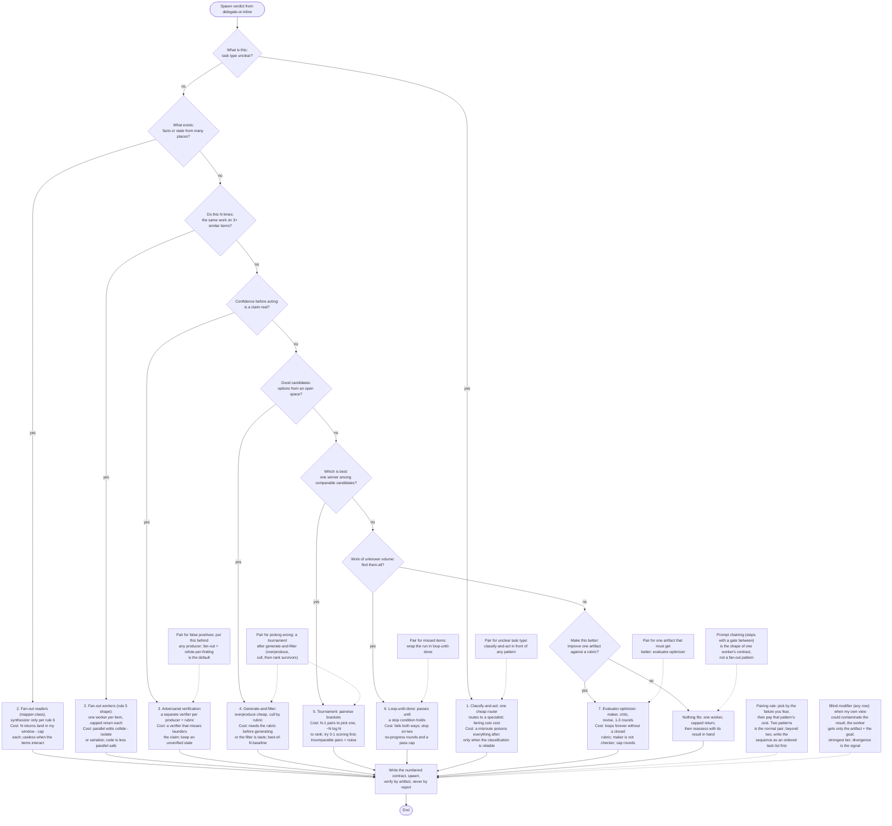

# Spawn-strategy router: which workflow pattern the spawn gets

Source of truth: `.kiro/skills/agent-orchestration-workflows/SKILL.md` (The seven workflow
patterns). This chart restates it; the source binds.

## How to read

- Rectangles are actions, diamonds are decisions, stadiums are the start and end, and nodes
  joined by dotted edges are standing modifiers (the pairing rule and the blind modifier).
- The chart covers the router table, the pairing rule, the numbered names, and the blind
  modifier.
- The classify question is asked first because the pairing rule puts classify-and-act in
  front of any other pattern; the router table lists it near the end.
- The start node is the spawn verdict from the delegate-or-inline chart; rule 5's fan-out
  and rule 6's synthesizer are the two fan-out rows here, both pattern 2.
- Each pattern node shortens its row's "Cost, and when it hurts" cell; the cell in the skill
  binds when they differ.
- The chain follows table order and does not rank rows; when two questions are both true,
  the pairing rule is how you add the second pattern.
