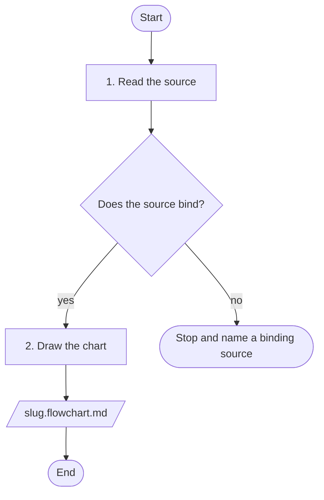

# Flowchart

## Purpose

A chart restates a source that already binds: a skill section, a steering file, a spec's
`design.md`, a script's control flow. It never invents process. The chart is a markdown file
in the repo. Kiro renders the mermaid block in markdown preview; there is no build tool and no
separate page.

## When a chart earns its place

Make a chart when one of these holds:

- The operator asks for one.
- A procedure has three or more decisions and readers keep re-deriving the path.
- A skill routes work (delegate or inline, which agent to spawn) and the routing is the point.

Do not make one when the source is a plain ordered list with no decisions, or when the source
still changes daily; that chart is stale before it is read.

## File rule

- Name: `<slug>.flowchart.md`. The slug is lowercase-hyphen and names the subject, not the date.
- Location, three cases:
  - A chart of a skill's procedure lives in that skill's `references/` folder.
  - A chart of a spec's flow lives in that spec's folder.
  - A chart of the whole repo lives in `README.md`.
- Contents, in this order:
  1. An H1 title.
  2. One line: `Source of truth: <path> (<section>). This chart restates it; the source binds.`
  3. One fenced block with the language tag `mermaid`.
  4. A short `## How to read` note: the legend, what the chart omits, and any gap in the source
     ("the source does not say what happens when ...").

One chart per file, revised in place when the source changes. A subject over 40 nodes becomes
an overview file and a detail file, each linking the other from its note.

## House grammar

Every chart uses this subset and nothing outside it. The subset is small so every chart reads
the same way.

- First line `flowchart TD`. Top-down only.
- Node shapes, each with one meaning:
  - `id(["text"])` stadium: start or end.
  - `id["text"]` rectangle: an action. Starts with a verb.
  - `id{"text"}` diamond: a decision, written as a question ending in `?`.
  - `id[/"text"/]` parallelogram: an input or output file, artifact, or verdict.
- Labels always in double quotes. Line breaks with ` `. At most 4 lines per node and 44
  characters per line. Longer text goes in the note.
- Edges: `a --> b` for flow, `a -- "label" --> b` for labelled flow, `a -.-> b` for a standing
  rule attached to the node it modifies. Dotted edges carry no label. One edge per line, no
  chains. Labels are short: `yes`, `no`, `pass`, `fail`.
- Every decision has at least two outgoing labelled edges. A decision with one exit is an
  action.
- Exactly one start node. Every id used in an edge is defined; every defined node appears in
  an edge.
- `subgraph <id> ["text"]` ... `end` groups a phase. Nothing else: no `classDef`, no `style`,
  no `click`, no `%%` comments inside the fence.
- Ids match `[A-Za-z][A-Za-z0-9_]*`.
- Step or rule numbers from the source go in the node text so a reader can find the line.

Example:

## Authoring steps

1. Name the source. One chart charts one binding artifact. If the source spans files, list
   every file and read them all. Do not chart from memory.
2. Derive the actions and decisions in the order the source states them. Each decision is a
   question with a yes and a no in the source. A standing rule that applies everywhere becomes
   a dotted edge onto the node it modifies.
3. Draw the chart in the house grammar. Open the markdown preview and confirm it renders.
4. Check every decision has both branches. A missing branch is either a gap in the source
   (write it in the note) or a decision that is really an action (change the shape).
5. Check every path reaches an end node. Trace from the start along every edge. A dead end is
   a missing edge or a missing end node.
6. Read the chart back against the source. Every branch in the source appears in the chart;
   every edge in the chart has a line in the source. Nothing the source does not say.

## Related skills

- `agent-orchestration-workflows` holds the delegate-or-inline chart, the standard first chart
  in a repo.
- `common-pitfalls` holds the markdown lint rules the chart file follows.
