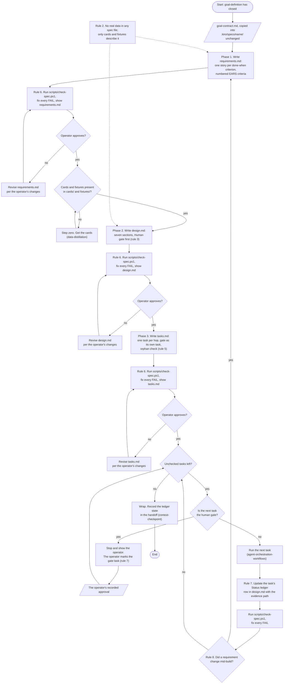

# Spec phases: from goal contract to wrap

Source of truth: `.kiro/skills/spec-authoring/SKILL.md` (Rules; Phase 1 to Phase 3) and
`.kiro/steering/00-session-opener.md` (The flow every project follows, rows Build to Wrap).
This chart restates them; the sources bind.

## How to read

- Rectangles are actions, diamonds are decisions, stadiums are the start and end, and
  parallelograms are files or verdicts; the dotted node is a standing rule on the phases it
  touches.
- Each of the three phases ends in the same stop: run the check script, show the file, wait;
  a "no" loops on the operator's changes, never on a guess.
- The cards question sits before design because the Mechanism section cannot be written
  without the schema card; the source says to stop and ask, not to invent columns.
- The build loop runs one task at a time and returns to "Unchecked tasks left?"; the human gate
  is one of those tasks and only the operator marks it done.
- The sources do not say who decides that a task's evidence is sufficient before the ledger
  row is updated; the chart assumes the session does and the operator sees it at the gate.
