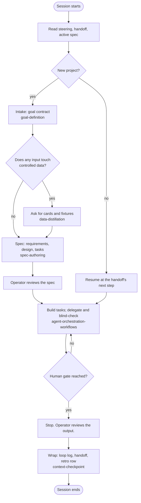

# agent-harness-foundation

A harness for running an AI coding agent on real engineering work in the Kiro IDE: what the
agent reads at boot, how it turns a request into a spec, how it keeps controlled data out of
the IDE, when it stops for a human, and how it hands off to the next session. Plain markdown
plus three optional PowerShell scripts. No extensions, no MCP, no Node required.

It is written for a model that follows explicit structure and does not infer missing steps.
Every step names the file that governs it.

## Clone and go

1. Clone this repo into the project folder, or copy `.kiro/`, `steering/`, `skills/`,
   `agents/`, `handoffs/`, `scripts/`, `AGENTS.md`, and `banned-terms.txt` into an existing
   project.
2. Open the folder in Kiro. The files under `.kiro/steering/` load on every turn. Skills and
   agents under `.kiro/` are picked up automatically.
3. Replace `banned-terms.txt` with the site list (program names, part numbers, project codes).
4. Start a chat. The agent reads `steering/00-session-opener.md`, then
   `handoffs/NEXT_AGENT_HANDOFF.md`, and asks for the first project request.

Optional: `powershell -NoProfile -ExecutionPolicy Bypass -File scripts/check-redaction.ps1`
before every commit. `scripts/README.md` describes the three scripts. The markdown works without them.

A companion repo, a trimmed fork of the Ponytail coding-style ruleset, adds a code-minimalism
steering file and four skills. Clone it beside this one and copy its `.kiro/steering/` and
`.kiro/skills/` entries in, or use it on its own.

## The flow



## Layout

```text
AGENTS.md                 the five-line boot note for tools that read only AGENTS.md
banned-terms.txt          terms that must not appear in the repo; the site list at work
steering/                 always-on rules (source); one domain per file
  00-session-opener.md    read order, the flow, the rules that hold every turn
  10-operator-profile.md  who the operator is and how to talk to them
  20-method.md            design backwards, name the judge, do not self-grade
  30-structure.md         what lives where, hygiene, budgets, source control
  40-data-boundary.md     real data never enters the IDE
skills/                   procedures loaded on demand (source); skills/README.md routes them
agents/                   spawnable roles (source); agents/README.md is the roster
handoffs/                 NEXT_AGENT_HANDOFF.md, LOOP_LOG.md, RETRO.md
.kiro/
  steering/ skills/ agents/   installed copies, generated by scripts/install-kiro.ps1
  specs/<name>/               one folder per job: goal contract, cards, fixtures,
                              requirements, design, tasks; the example adds
                              run-report.ps1 and stubs/
scripts/                  install-kiro.ps1, check-redaction.ps1, distill-fixture.ps1
```

Edit `steering/`, `skills/`, and `agents/` at the root, then run `scripts/install-kiro.ps1`
and commit both. Edit `.kiro/specs/` directly; it is never generated.

## The worked example

`.kiro/specs/text-to-vba-to-matlab-to-pdf/` walks the flow once on a synthetic job: delimited
text files land in a folder, an existing spreadsheet macro reshapes them, an existing MATLAB
function writes a PDF report, a person reviews the PDF. It shows the goal contract, the three
cards, synthetic fixtures, EARS requirements, a design that names every invocation, a task
list, and a one-command runner. Nothing in it is real data. It is a reference, not a template
to copy values from.

## Rules in one place

- Real project data never enters the IDE. Shape enters through cards and synthetic fixtures.
- The agent decides execution; the operator decides intent, spend, time, and approach.
- A plan or result is checked by a blind critic before it is relied on.
- Every human gate the design names is a full stop.
- The handoff is rewritten at every wrap; the next session verifies it against disk.

## License

MIT. See `LICENSE`.
